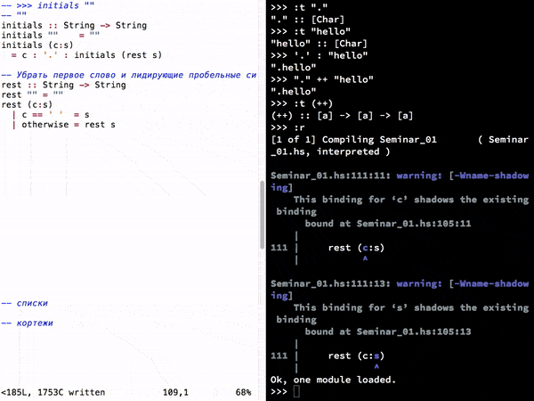

# Семинар 01 (вводный)

## Что нужно для работы с Haskell

Для работы с Haskell рекомендуется [установить Haskell Platform](https://www.haskell.org/platform/).

На этом и последующем семинарах мы будем пользоваться снепшотом LTS-10.5
(снепшот определяет версии компилятора и используемых библиотек,
чтобы исключить конфликты версий). Снепшот указывается в файле `stack.yaml`.

## Работа с интерпретатором GHCi

Для работы на семинаре рекомендуется использовать ваш любимый текстовый редактор
вместе с интерпретатором GHCi. Вам предлагается разделить экран на две части:

- в одной части экрана откройте текстовый редактор с исходным файлом;
- во второй части экрана откройте интерпрератор GHCi.



Чтобы открыть интерпретатор рекомендуется использовать команду

```
stack exec ghci seminar-01/Seminar_01.hs
```

`stack exec ghci` гарантированно запускает интерпретатор `ghci`
с нужной версией компилятора и библиотек,
при этом без автозагрузки других проектов.

### Полезные команды интерпретатора

#### Загрузка и обновление модулей

Для загрузки (нового) файла из интерпретатора используйте команду `:l` (сокращённо от `:load`):

```
>>> :l seminar-01/Seminar_01.hs
[1 of 1] Compiling Seminar_01       ( seminar-01/Seminar_01.hs, interpreted )
Ok, one module loaded.
```

После внесения изменений в исходный код (в текстовом редакторе), используйте
команду `:r` (сокращённо от `:reload`), чтобы загрузить код повторно:

```
>>> :r
[1 of 1] Compiling Seminar_01       ( seminar-01/Seminar_01.hs, interpreted )
Ok, one module loaded.
```

#### Информация о типе выражения

Поскольку одна из основных преимуществ Haskell — это мощная система типов,
часто бывает удобно проверить тип выражения, используя интерпретатор.
Для этого используйте команду `:t` (сокращённо от `:type`):

```
>>> :t 'Я'
'Я' :: Char
>>> :t "Привет"
"Привет" :: [Char]
>>> :t 123
123 :: Num p => p
>>> :t factorial
factorial :: Integer -> Integer
>>> :t factorial 7
factorial 7 :: Integer
```

## Ключевые моменты семинара

На семинаре мы вспомнили

- объявление переменных и функций;
- основные типы (`Int`, `Float`, `Bool`, `Char`, `String`, кортежи и списки);
- синтаксис для сопоставления с образцом (для чисел, строк и списков).

Несколько общих советов, которые прозвучали на семинаре:

- если непонятно, с чего начать определение функции, начните с сопоставления с образцом;
- если компилятор выдал несколько ошибок — смотрите на первую;
- обязательно включайте ворнинги (опция `-Wall`);
- не используйте частично-определённые функции (например, `head` и `tail`),
  потому что они могут привести к ошибке во время работы программы;
  вместо частично-определённых функций используйте сопоставление с образцом (например, через `case`);
- если непонятно, какое именно изменение в коде является причиной ошибки,
  применяйте универсальный приём "нет кода – нет ошибок":
  убирайте изменения до тех пор, пока не наткнётесь на изменение, которое влияет на ошибку;


### Чат-бот для управления задачами

В качестве более интересного мини-проекта мы разобрали простого чат-бота,
который ведёт учёт текущих задач пользователя.

На семинаре мы добавили боту команду `/complete` для завершения последней задачи,
а также реализовали простую нумерацию задач при отображении в команде `/show`.

Вот несколько идей для реализации дома, чтобы лучше вникнуть в код:

- добавить возможность завершать задачу по номеру;
- добавить возможность завершать задачу по названию;
- отображать номера красивее (например, `1. провести семинар`);
- изменить порядок добавления задач (чтобы добавлялись в конец);
- добавить команду `/help`, выводящую информацию о том, что умеет бот;
- добавить команду `/search` для поиска по задачам (например, `/search купить`);
- добавить возможность задавать приоритет для задач и выводить задачи в порядке приоритета.

Можете подумать над другими дополнительными возможностями!
